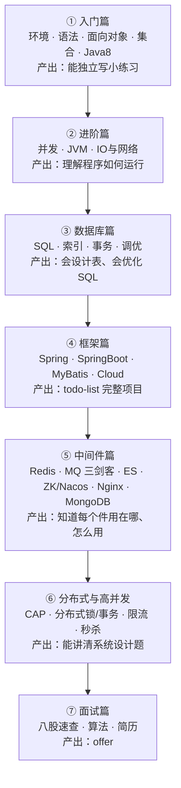

> 建议搭配 [STUDY-TRACKER.md](/java-study-guide/posts/STUDY-TRACKER/) 使用：每完成一个知识点就打卡。时长按每天 2~3 小时估算。

## 一图看懂

两条贯穿线与主线并行：

- **项目线**：`todo-list API`（框架篇）→ 接入 MyBatis-Plus（MyBatis 篇）→ 加缓存与消息队列（中间件篇）→ 演进为秒杀系统（高并发篇）。每个阶段都在同一个项目上叠加，面试时就是一段完整的成长故事。
- **算法线**：从进阶篇开始，每天 2~3 题，按 [03-算法刷题路线](/java-study-guide/posts/03-算法刷题路线/) 推进。

## 阶段总表

| 阶段 | 建议时长 | 核心文件 | 过关标准（全部满足才进入下一阶段） |
|------|---------|----------|------------------------------------|
| ① 入门篇 | 3 周 | [入门篇 5 个文件](/java-study-guide/posts/01-环境搭建与基础语法/) | 不查资料能写出：集合统计词频、异常+反射的小工具、Stream 处理订单列表；文件末尾面试题能答 80% |
| ② 进阶篇 | 3 周 | [并发](/java-study-guide/posts/01-多线程与并发编程/)、[JVM](/java-study-guide/posts/02-JVM核心/)、[IO网络](/java-study-guide/posts/03-IO模型与网络编程/) | 能手写线程池使用代码并解释 7 参数；能用 jstack/jmap 分析死锁与 OOM；能讲三次握手与 NIO 三大件 |
| ③ 数据库篇 | 2 周 | [MySQL 基础](/java-study-guide/posts/01-MySQL基础与SQL实战/)、[索引事务调优](/java-study-guide/posts/02-索引-事务-锁与调优/) | 学生选课库 10 道 SQL 全部独立完成；能解释 B+ 树/MVCC/三大日志；能对慢 SQL 做 explain 分析 |
| ④ 框架篇 | 3 周 | [Spring](/java-study-guide/posts/01-Spring核心/)、[SpringBoot](/java-study-guide/posts/02-SpringBoot实战/)、[MyBatis](/java-study-guide/posts/03-MyBatis/)、[SpringCloud](/java-study-guide/posts/04-SpringCloud微服务/) | todo-list 项目上线本地运行：CRUD+校验+全局异常+缓存；能讲自动配置原理与事务失效场景 |
| ⑤ 中间件篇 | 3 周 | [Redis](/java-study-guide/posts/01-Redis/)、[RabbitMQ](/java-study-guide/posts/02-RabbitMQ/)、[Kafka](/java-study-guide/posts/03-Kafka/)、[RocketMQ](/java-study-guide/posts/04-RocketMQ/)、[ES](/java-study-guide/posts/05-Elasticsearch/)、[ZK/Nacos](/java-study-guide/posts/06-ZooKeeper与Nacos/)、[Nginx](/java-study-guide/posts/07-Nginx/)、[MongoDB](/java-study-guide/posts/08-MongoDB/) | 每个中间件都完成 Docker 部署 + Spring Boot 整合 demo；能说出每个件的 3 个使用场景与核心可靠性问题 |
| ⑥ 分布式与高并发 | 2 周 | [分布式理论](/java-study-guide/posts/01-分布式理论基础/)、[高并发设计](/java-study-guide/posts/02-高并发系统设计/) | 能白板画出秒杀系统全链路并解释防超卖；能对比三种分布式锁与四种限流算法 |
| ⑦ 面试篇 | 3~4 周 | [八股速查一](/java-study-guide/posts/01-Java高频八股速查/)、[八股速查二](/java-study-guide/posts/02-数据库与中间件面试速查/)、[选择填空题库](/java-study-guide/posts/05-选择填空题库/)、[考点详略表](/java-study-guide/posts/06-考点详略表/)、[算法路线](/java-study-guide/posts/03-算法刷题路线/)、[简历求职](/java-study-guide/posts/04-简历与求职指南/) | 175 道自测题全部打勾；章节小考逐章 90%+；综合大考 20 题 ≥85%；算法 200 题完成；简历定稿并完成 3 次模拟面试 |

合计约 19~20 周（零基础按部就班约 5 个月，加上缓冲 6 个月）。

## 三档时间规划

### A. 零基础 · 6~7 个月（默认节奏）

| 月份 | 内容 |
|------|------|
| 第 1 月 | 入门篇全部 + 开始算法（数组、链表专题） |
| 第 2 月 | 进阶篇（并发重推 1 周）+ 算法（栈队列、哈希） |
| 第 3 月 | 数据库篇 + 框架篇前半（Spring、SpringBoot，完成 todo-list） |
| 第 4 月 | 框架篇后半（MyBatis、SpringCloud）+ 中间件篇（Redis、RabbitMQ） |
| 第 5 月 | 中间件篇其余 + 分布式与高并发篇；项目加中间件 |
| 第 6 月 | 面试篇：八股清单每天过、算法套卷、简历与模拟面 |
| 第 7 月 | 查漏补缺 + 投递 |

### B. 有其他语言基础 · 3 个月

- 第 1~2 周：入门篇快速过（语法对照学，重点看面向对象、集合、Java8）。
- 第 3~5 周：进阶篇 + 数据库篇并行，算法每天保持。
- 第 6~8 周：框架篇，完成 todo-list 项目。
- 第 9~10 周：中间件篇 + 分布式篇，项目加中间件。
- 第 11~12 周：面试篇冲刺。

### C. 临门冲刺 · 1 个月（已有项目与八股基础）

- 每天上午：[八股速查](/java-study-guide/posts/01-Java高频八股速查/) 两个板块 + 对应指南文件补漏。
- 每天下午：算法 3~4 题（按专题）+ 手撕模板默写。
- 每天晚上：中间件场景题（[Redis](/java-study-guide/posts/01-Redis/)、[MQ 选型](/java-study-guide/posts/04-RocketMQ/)、[秒杀设计](/java-study-guide/posts/02-高并发系统设计/)）+ [简历打磨](/java-study-guide/posts/04-简历与求职指南/)。

## 学习方法建议

1. **先资料后提纲**：每个文件先读「推荐资料」里的廖雪峰/JavaGuide 对应章节（原始讲解更细），再用本指南的「核心知识点」当提纲复习，用「高频面试题」验收。
2. **代码必须亲手敲**：动手实践的任务不要复制粘贴；中间件全部用 Docker 起服务，练习启停与排错本身也是面试考点。
3. **API 随手查**：忘掉类和方法签名时用 [Java 8 中文 API](https://www.matools.com/api/java8)，不要背 API。
4. **输出倒逼输入**：每完成一篇，用自己的话写 200 字笔记（或讲给朋友/橡皮鸭听），讲不清的地方就是漏洞。
5. **面试题不是背的**：先理解，再把答案压缩成 3~6 条要点——压缩不出来的，说明还没懂，回知识点重看。
